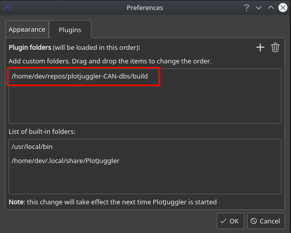
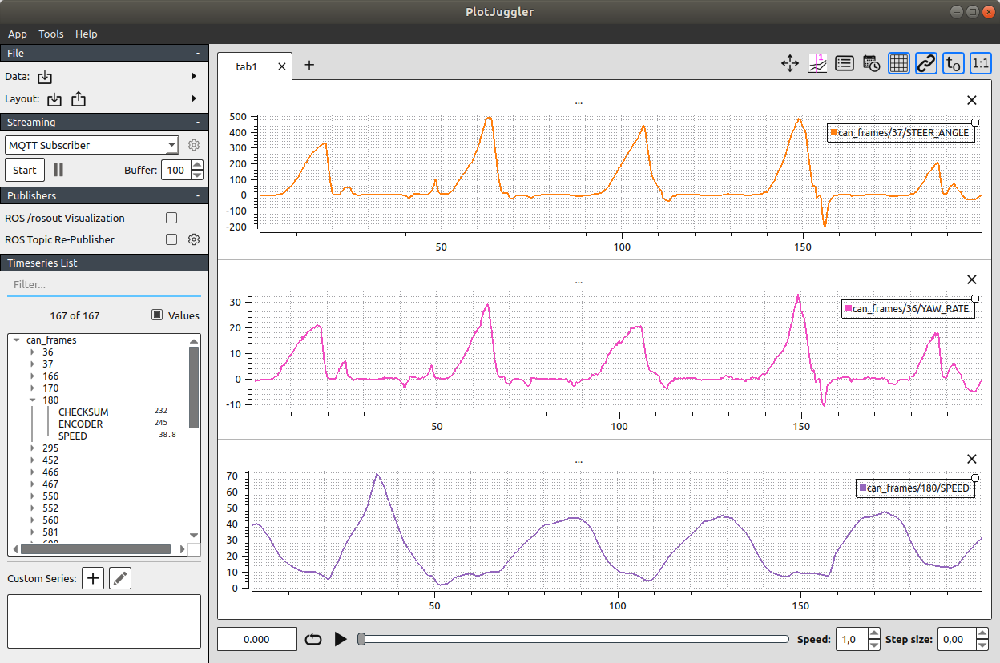
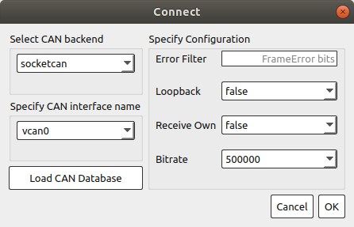

# plotjuggler-CAN-dbs
Plugins to visualize CAN .dbs files and streams in PlotJuggler.

Using the plugins, One can;
  * Visualize CAN logs created by `candump -L` in PlotJuggler using a can database file (for ex. .dbc)
  * Visualize CAN streams

# Prerequisites
  * Boost (1.72 or later)
  * libxml2
  * PlotJuggler (3.2 or later)
  * Qt5 SerialBus (Optional, required for DataStreamCAN)

# Building the CAN plugins

To build any plugin, PlotJuggler must be installed in your system.

For instance, in Linux, you should perform a full compilation and installation:

```
git clone --recurse-submodules https://github.com/facontidavide/PlotJuggler.git
cd PlotJuggler
mkdir build; cd build
cmake ..
make -j
sudo make install
```
After successfull installation of PlotJuggler, one can build DataLoadCAN and DataStreamCAN plugins as follows.
```
git clone --recurse-submodules https://github.com/PlotJuggler/plotjuggler-CAN-dbs.git
cd plotjuggler-CAN-dbs
mkdir build; cd build
cmake ..
make

```

# Using the plugins

After building the plugins, one needs to include build directory to the plugins directory of the PlotJuggler.

App -> Preferences -> Plugins



## DataLoadCAN

If DataLoadCAN plugin is loaded, you will be able to import `.log` files. When a `.log` file is choosen, another dialog will be opened for selecting the database (`.dbc`) and the protocol (`RAW`, `NMEA2K` or `J1939`).



## DataStreamCAN

CAN Streamer plugin is only built if Qt5 SerialBus plugin is installed in your machine (surprisingly, it is not possible to install via apt on Ubuntu 18.04).
If you want to use CAN Streamer plugin (and your machine does not have the plugin), you can check [this gist](https://gist.github.com/awesomebytes/ed90785324757b03c8f01e3ffa36d436) for instructions on how to install Qt5 Serialbus.

When you start CAN Streamer plugin, a connect dialog will be opened as in the figures below. After choosing the correct backend and interface, one need to click `Load CAN Database`, which opens another dialog for selecting the database (`.dbc` only for now) and the protocol (`RAW`, `NMEA2K` or `J1939`). Only after the database dialog is accepted, OK button will be enabled for you to start the streamer.



# Details about the plugins

RAW CAN signals are added to the plot in the following format:

`can_frames/<FrameId,DecStr>/<SignalName>`

NMEA2K signals are added to the plot in the following formats:

* When the received PGN is PDU Format 1:
  * `nmea2k_msg/PDUF1/<MessageName> (<PGN with destination addr cleared>)/<SourceAddr,HexStr>/<DestinationAddr,HexStr>/<SignalName>`
* When the received PGN is PDU Format 2 (i.e. broadcast type):
  * `nmea2k_msg/PDUF2/<MessageName> (<PGN>)/<SourceAddr,HexStr>/<SignalName>`

J1939 signals are added to the plot just like the NMEA2K ones, with only difference being the the use of prefix `j1939_msg` instead of `nmea2k_msg`.
